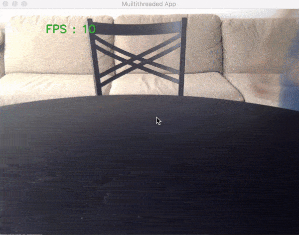
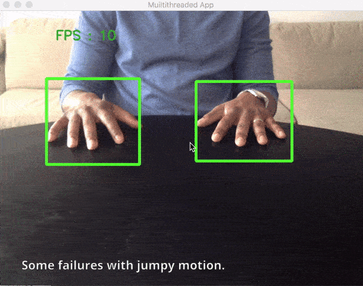
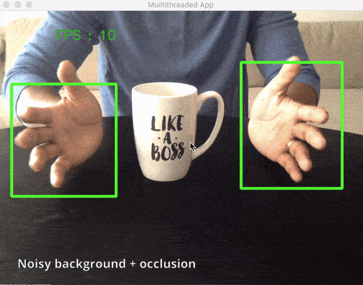
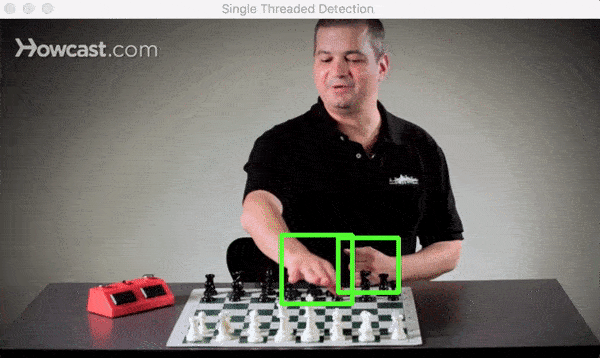
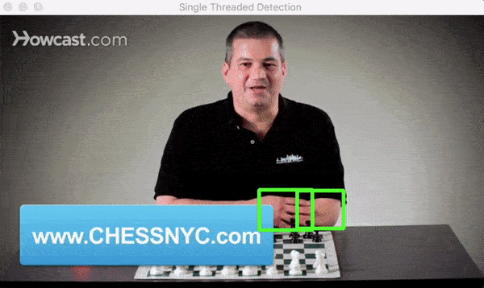
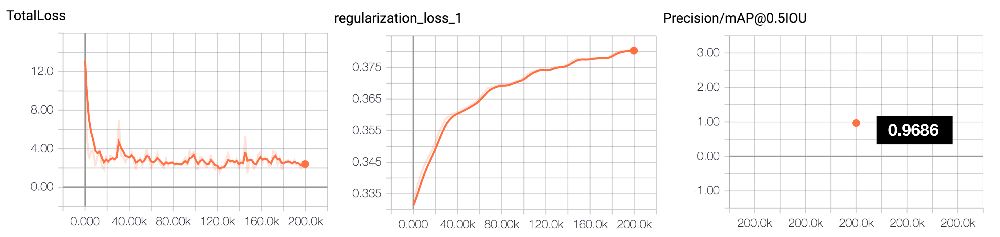
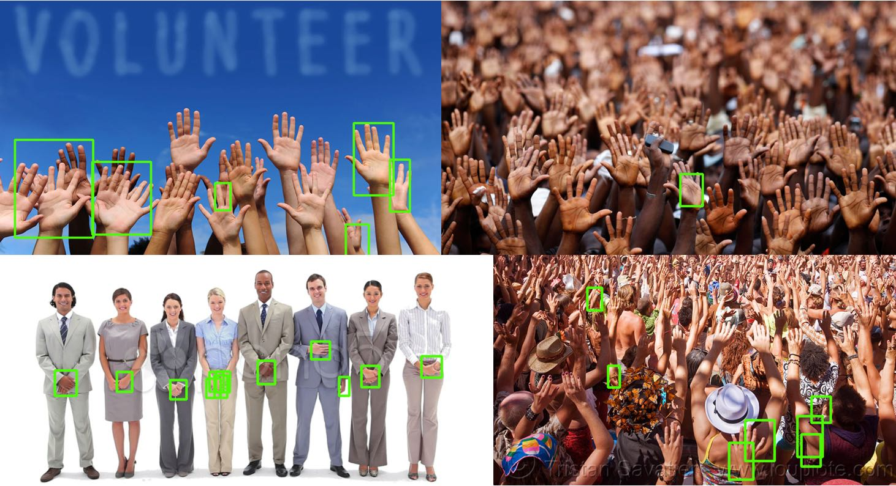

## Real-time Hand-Detection using Neural Networks (SSD) on Tensorflow.

This repo documents steps and scripts used to train a hand detector using Tensorflow (Object Detection API). As with any DNN based task, the most expensive (and riskiest) part of the process has to do with finding or creating the right (annotated) dataset. I was interested mainly in detecting hands on a table (egocentric view point). I experimented first with the [Oxford Hands Dataset](http://www.robots.ox.ac.uk/~vgg/data/hands/) (the results were not good). I then tried the [Egohands Dataset](http://vision.soic.indiana.edu/projects/egohands/) which was a much better fit to my requirements.

The goal of this repo/post is to demonstrate how neural networks can be applied to the (hard) problem of tracking hands (egocentric and other views). Better still, provide code that can be adapted to other uses cases.

If you use this tutorial or models in your research or project, please cite [this](#citing-this-tutorial).

Here is the detector in action.


Realtime detection on video stream from a webcam .


Detection on a Youtube video.

Both examples above were run on a macbook pro **CPU** (i7, 2.5GHz, 16GB). Some fps numbers are:


| FPS  | Image Size | Device| Comments|
| ------------- | ------------- | ------------- | ------------- |
| 21  | 320 * 240  | Macbook pro (i7, 2.5GHz, 16GB) | Run without visualizing results|
| 16  | 320 * 240  | Macbook pro (i7, 2.5GHz, 16GB) | Run while visualizing results (image above) |
| 11  | 640 * 480  | Macbook pro (i7, 2.5GHz, 16GB) | Run while visualizing results (image above) |

> Note: The code in this repo is written and tested with Tensorflow `1.4.0-rc0`. Using a different version may result in [some errors](https://github.com/tensorflow/models/issues/1581).
You may need to [generate your own frozen model](https://pythonprogramming.net/testing-custom-object-detector-tensorflow-object-detection-api-tutorial/?completed=/training-custom-objects-tensorflow-object-detection-api-tutorial/) graph using the [model checkpoints](model-checkpoint) in the repo to fit your TF version.


**Content of this document**
- Motivation - Why Track/Detect hands with Neural Networks
- Data preparation and network training in Tensorflow (Dataset, Import, Training)
- Training the hand detection Model
- Using the Detector to Detect/Track hands
- Thoughts on Optimizations.

> P.S if you are using or have used the models provided here, feel free to reach out on twitter ([@vykthur](https://twitter.com/vykthur)) and share your work!

## Motivation - Why Track/Detect hands with Neural Networks?

There are several existing approaches to tracking hands in the computer vision domain. Incidentally, many of these approaches are rule based (e.g extracting background based on texture and boundary features, distinguishing between hands and background using color histograms and HOG classifiers,) making them not very robust. For example, these algorithms might get confused if the background is unusual or in situations where sharp changes in lighting conditions cause sharp changes in skin color or the tracked object becomes occluded.(see [here for a review](https://www.cse.unr.edu/~bebis/handposerev.pdf) paper on hand pose estimation from the HCI perspective)

With sufficiently large datasets, neural networks provide opportunity to train models that perform well and address challenges of existing object tracking/detection algorithms - varied/poor lighting, noisy environments, diverse viewpoints and even occlusion. The main drawbacks to usage for real-time tracking/detection is that they can be complex, are relatively slow compared to tracking-only algorithms and it can be quite expensive to assemble a good dataset. But things are changing with advances in fast neural networks.

Furthermore, this entire area of work has been made more approachable by deep learning frameworks (such as the tensorflow object detection api) that simplify the process of training a model for custom object detection. More importantly, the advent of fast neural network models like ssd, faster r-cnn, rfcn (see [here](https://github.com/tensorflow/models/blob/master/research/object_detection/g3doc/detection_model_zoo.md#coco-trained-models-coco-models) ) etc make neural networks an attractive candidate for real-time detection (and tracking) applications. Hopefully, this repo demonstrates this.

> If you are not interested in the process of training the detector, you can skip straight to applying the [pretrained model I provide in detecting hands](#detecting-hands).

Training a model is a multi-stage process (assembling dataset, cleaning, splitting into training/test partitions and generating an inference graph). While I lightly touch on the details of these parts, there are a few other tutorials cover training a custom object detector using the tensorflow object detection api in more detail[ see [here](https://pythonprogramming.net/training-custom-objects-tensorflow-object-detection-api-tutorial/) and [here](https://towardsdatascience.com/how-to-train-your-own-object-detector-with-tensorflows-object-detector-api-bec72ecfe1d9) ]. I recommend you walk through those if interested in training a custom object detector from scratch.

## Data preparation and network training in Tensorflow (Dataset, Import, Training)

**The Egohands Dataset**

The hand detector model is built using data from the [Egohands Dataset](http://vision.soic.indiana.edu/projects/egohands/) dataset. This dataset works well for several reasons. It contains high quality, pixel level annotations (>15000 ground truth labels) where hands are located across 4800 images. All images are captured from an egocentric view (Google glass) across 48 different environments (indoor, outdoor) and activities (playing cards, chess, jenga, solving puzzles etc).


If you will be using the Egohands dataset, you can cite them as follows:

> Bambach, Sven, et al. "Lending a hand: Detecting hands and recognizing activities in complex egocentric interactions." Proceedings of the IEEE International Conference on Computer Vision. 2015.

The Egohands dataset (zip file with labelled data) contains 48 folders of locations where video data was collected (100 images per folder).
```
-- LOCATION_X
  -- frame_1.jpg
  -- frame_2.jpg
  ...
  -- frame_100.jpg
  -- polygons.mat  // contains annotations for all 100 images in current folder
-- LOCATION_Y
  -- frame_1.jpg
  -- frame_2.jpg
  ...
  -- frame_100.jpg
  -- polygons.mat  // contains annotations for all 100 images in current folder
  ```

**Converting data to Tensorflow Format**

Some initial work needs to be done to the Egohands dataset to transform it into the format (`tfrecord`) which Tensorflow needs to train a model. This repo contains `egohands_dataset_clean.py` a script that will help you generate these csv files.

- Downloads the egohands datasets
- Renames all files to include their directory names to ensure each filename is unique
- Splits the dataset into train (80%), test (10%) and eval (10%) folders.
- Reads in `polygons.mat` for each folder, generates bounding boxes and visualizes them to ensure correctness (see image above).
- Once the script is done running, you should have an images folder containing three folders - train, test and eval. Each of these folders should also contain a csv label document each - `train_labels.csv`, `test_labels.csv`  that can be used to generate `tfrecords`

Note: While the egohands dataset provides four separate labels for hands (own left, own right, other left, and other right), for my purpose, I am only interested in the general `hand` class and label all training data as `hand`. You can modify the data prep script to generate `tfrecords` that support 4 labels.

Next: convert your dataset + csv files to tfrecords. A helpful guide on this can be found [here](https://pythonprogramming.net/creating-tfrecord-files-tensorflow-object-detection-api-tutorial/).For each folder, you should be able to generate  `train.record`, `test.record` required in the training process.


## Training the hand detection Model

Now that the dataset has been assembled (and your tfrecords), the next task is to train a model based on this. With neural networks, it is possible to use a process called [transfer learning](https://www.tensorflow.org/tutorials/image_retraining) to shorten the amount of time needed to train the entire model. This means we can take an existing model (that has been trained well on a related domain (here image classification) and retrain its final layer(s) to detect hands for us. Sweet!. Given that neural networks sometimes have thousands or millions of parameters that can take weeks or months to train, transfer learning helps shorten training time to possibly hours. Tensorflow does offer a few models (in the tensorflow [model zoo](https://github.com/tensorflow/models/blob/master/research/object_detection/g3doc/detection_model_zoo.md#coco-trained-models-coco-models)) and I chose to use the `ssd_mobilenet_v1_coco` model as my start point given it is currently (one of) the fastest models (read the SSD research [paper here](https://arxiv.org/pdf/1512.02325.pdf)). The training process can be done locally on your CPU machine which may take a while or better on a (cloud) GPU machine (which is what I did). For reference, training on my macbook pro (tensorflow compiled from source to take advantage of the mac's cpu architecture) the maximum speed I got was 5 seconds per step as opposed to the ~0.5 seconds per step I got with a GPU. For reference it would take about 12 days to run 200k steps on my mac (i7, 2.5GHz, 16GB) compared to ~5hrs on a GPU.

Please use the guide provided by Harrison from pythonprogramming on how to generate tfrecords given your label csv files and your images. The guide also covers how to start the training process if training locally. [see [here](https://pythonprogramming.net/training-custom-objects-tensorflow-object-detection-api-tutorial/)]. If training in the cloud using a service like GCP, see the [guide here](https://github.com/tensorflow/models/blob/master/research/object_detection/g3doc/running_on_cloud.md).

As the training process progresses, the expectation is that total loss (errors) gets reduced to its possible minimum (about a value of 1 or thereabout). By observing the tensorboard graphs for total loss(see image below), it should be possible to get an idea of when the training process is complete (total loss does not decrease with further iterations/steps). I ran my training job for 200k steps (took about 5 hours) and stopped at a total Loss (errors) value of 2.575.(In retrospect, I could have stopped the training at about 50k steps and gotten a similar total loss value). With tensorflow, you can also run an evaluation concurrently that assesses your model to see how well it performs on the test data. A commonly used metric for performance is mean average precision (mAP) which is single number used to summarize the area under the precision-recall curve.  mAP is a measure of how well the model generates a bounding box that has at least a 50% overlap with the ground truth bounding box in our test dataset. For the hand detector trained here, the mAP value was **0.9686@0.5IOU**. mAP values range from 0-1, the higher the better.  




Once training is completed, the trained inference graph (`frozen_inference_graph.pb`) is then exported (see the earlier referenced guides for how to do this) and saved in the `hand_inference_graph` folder. Now its time to do some interesting detection.

## Using the Detector to Detect/Track hands


If you have not done this yet, please following the guide on installing [Tensorflow and the Tensorflow object detection api](https://github.com/tensorflow/models/blob/master/research/object_detection/g3doc/installation.md). This will walk you through setting up the tensorflow framework, cloning the tensorflow github repo and a guide on  

- Load the `frozen_inference_graph.pb` trained on the hands dataset as well as the corresponding label map. In this repo, this is done in the `utils/detector_utils.py` script by the `load_inference_graph` method.
  ```python
  detection_graph = tf.Graph()
    with detection_graph.as_default():
        od_graph_def = tf.GraphDef()
        with tf.gfile.GFile(PATH_TO_CKPT, 'rb') as fid:
            serialized_graph = fid.read()
            od_graph_def.ParseFromString(serialized_graph)
            tf.import_graph_def(od_graph_def, name='')
        sess = tf.Session(graph=detection_graph)
    print(">  ====== Hand Inference graph loaded.")
  ```
- Detect hands. In this repo, this is done in the `utils/detector_utils.py` script by the `detect_objects` method.
  ```python
  (boxes, scores, classes, num) = sess.run(
        [detection_boxes, detection_scores,
            detection_classes, num_detections],
        feed_dict={image_tensor: image_np_expanded})
  ```
- Visualize detected bounding detection_boxes. In this repo, this is done in the `utils/detector_utils.py` script by the `draw_box_on_image` method.


This repo contains two scripts that tie all these steps together.

- detect_multi_threaded.py : A threaded implementation for reading camera video input detection and detecting. Takes a set of command line flags to set parameters such as `--display` (visualize detections), image parameters `--width` and `--height`, videe `--source` (0 for camera) etc.
- detect_single_threaded.py : Same as above, but single threaded. This script works for video files by setting the video source parameter videe `--source` (path to a video file).


```cmd
  # load and run detection on video at path "videos/chess.mov"
  python detect_single_threaded.py --source videos/chess.mov
```

> Update: If you do have errors loading the frozen inference graph in this repo, feel free to generate a new graph that fits your TF version from the model-checkpoint in this repo.
Use the [export_inference_graph.py](https://github.com/tensorflow/models/blob/master/research/object_detection/export_inference_graph.py) script provided in the tensorflow object detection api repo.
More guidance on this [here](https://pythonprogramming.net/testing-custom-object-detector-tensorflow-object-detection-api-tutorial/?completed=/training-custom-objects-tensorflow-object-detection-api-tutorial/).

## Thoughts on Optimization.
A few things that led to noticeable performance increases.

- Threading: Turns out that reading images from a webcam is a heavy I/O event and if run on the main application thread can slow down the program. I implemented some good ideas from [Adrian Rosebuck](https://www.pyimagesearch.com/2017/02/06/faster-video-file-fps-with-cv2-videocapture-and-opencv/) on parrallelizing image capture across multiple worker threads. This mostly led to an FPS increase of about 5 points.
- For those new to Opencv, images from the `cv2.read()` method return images in [BGR format](https://www.learnopencv.com/why-does-opencv-use-bgr-color-format/). Ensure you convert to RGB before detection (accuracy will be much reduced if you dont).
```python
cv2.cvtColor(image_np, cv2.COLOR_BGR2RGB)
```
- Keeping your input image small will increase fps without any significant accuracy drop.(I used about 320 x 240 compared to the 1280 x 720 which my webcam provides).

Performance can also be increased by a clever combination of tracking algorithms with the already decent detection and this is something I am still experimenting with. Have ideas for optimizing better, please share!


Note: The detector does reflect some limitations associated with the training set. This includes non-egocentric viewpoints, very noisy backgrounds (e.g in a sea of hands) and sometimes skin tone.  There is opportunity to improve these with additional data.


## Integrating Multiple DNNs.

One way to make things more interesting is to integrate our new knowledge of where "hands" are with other detectors trained to recognize other objects. Unfortunately, while our hand detector can in fact detect hands, it cannot detect other objects (a factor or how it is trained). To create a detector that classifies multiple different objects would mean a long involved process of assembling datasets for each class and a lengthy training process.  

> Given the above, a potential strategy is to explore structures that allow us **efficiently** interleave output form multiple pretrained models for various object classes and have them detect multiple objects on a single image.  

An example of this is with my primary use case where I am interested in understanding the position of objects on a table with respect to hands on same table. I am currently doing some work on a threaded application that loads multiple detectors and outputs bounding boxes on a single image. More on this soon.

## Acknowledgements

This work also served as an intense weekend crash course for me to learn Python and Tensorflow. It would be impossible without the Egohands Dataset, many thanks to the authors! The tensorflow custom object detection guides by [Harrison from pythonprogramming](https://pythonprogramming.net/training-custom-objects-tensorflow-object-detection-api-tutorial/) and [Dat Tran](https://towardsdatascience.com/how-to-train-your-own-object-detector-with-tensorflows-object-detector-api-bec72ecfe1d9) were immensely helpful to this learning process. And ofcourse, many thanks to the Tensorflow authors! Its a great frameworks!

## Projects that use this Repo

A few people have used the handtracking sample code/models in creating some awesome projects and I'd like to highlight them here!
- (Alphabot)[https://github.com/drewgillson/alphabot]: a screen-less interactive spelling primer powered by computer vision
- (Wall Z the Robot)[https://challengerocket.com/megatran/Wall-Z-the-Robot-8a34db.html]


If you have created something cool, send me a note (or tweet) and I'll be happy to include it here!

## Citing this tutorial

If you'd like to cite this work, use the below.

Victor Dibia, Real-time Hand-Detection using Neural Networks (SSD) on Tensorflow, (2017), GitHub repository, https://github.com/victordibia/handtracking
```bib
@misc{Dibia2017,
  author = {Victor, Dibia},
  title = {Real-time Hand Tracking Using SSD on Tensorflow },
  year = {2017},
  publisher = {GitHub},
  journal = {GitHub repository},
  howpublished = {\url{https://github.com/victordibia/handtracking}},
  commit = {b523a27393ea1ee34f31451fad656849915c8f42}
}
```

## References

Some related and referenced papers.

Bambach, S., Lee, S., Crandall, D. J., and Yu, C. 2015. “Lending A Hand: Detecting Hands and Recognizing Activities in Complex Egocentric Interactions,” in ICCV, pp. 1949–1957 (available at https://www.cv-foundation.org/openaccess/content_iccv_2015/html/Bambach_Lending_A_Hand_ICCV_2015_paper.html).

Erol, A., Bebis, G., Nicolescu, M., Boyle, R. D., and Twombly, X. 2007. “Vision-based hand pose estimation: A review,” Computer Vision and Image Understanding (108:1–2), pp. 52–73 (doi: 10.1016/j.cviu.2006.10.012).

Liu, W., Anguelov, D., Erhan, D., Szegedy, C., Reed, S., Fu, C. Y., and Berg, A. C. 2016. “SSD: Single shot multibox detector,” in European conference on computer vision (Vol. 9905 LNCS), Springer Cham, pp. 21–37 (doi: 10.1007/978-3-319-46448-0_2).

Betancourt, A., Morerio, P., Regazzoni, C. S., and Rauterberg, M. 2015. “The Evolution of First Person Vision Methods: A Survey,” IEEE Transactions on Circuits and Systems for Video Technology (25:5), pp. 744–760 (doi: 10.1109/TCSVT.2015.2409731)

Apache Licence. See [LICENSE](LICENSE) for details. Copyright (c) 2017 Victor Dibia.
